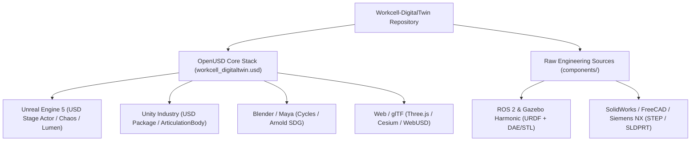

# Cross-Platform Digital Twin Engineering Analysis
## Consuming `Workcell-DigitalTwin` Beyond Omniverse & Isaac Sim: Unreal Engine, Unity, Gazebo, Blender & Web

---

## Executive Summary

The **Workcell-DigitalTwin** repository has been structured around **Pixar OpenUSD (Universal Scene Description)**, an open, extensible, vendor-neutral standard governed by the **Alliance for OpenUSD (AOUSD)**—comprising Pixar, Apple, NVIDIA, Adobe, and Autodesk—and the Linux Foundation.

Because the repository adheres to strict OpenUSD composition standards rather than proprietary, hardcoded simulator logic, **it is fundamentally portable to external real-time engines, DCC tools, and robotics simulators**.

Furthermore, because the asset retains foundational multi-format representations—including raw CAD (`.step`, `.sldprt`), standard 3D visual/collision meshes (`.obj`, `.dae`, `.stl`), Wavefront materials (`.mtl`), and standard robotics kinematics (`.urdf`)—it provides multiple ingestion pathways for teams that do not use NVIDIA Omniverse or Isaac Sim.



---

## 1. Cross-Platform Compatibility Matrix

| Feature / Layer | Omniverse / Isaac Sim | Unreal Engine 5.3+ | Unity Industry | Gazebo (ROS 2) | Blender 4.x | Web (Three.js/glTF) |
| :--- | :--- | :--- | :--- | :--- | :--- | :--- |
| **Layer Stack (`layers/`)** | Native Sublayers | Native Sublayers | Native Sublayers | Requires Flattening | Native Sublayers | Requires Flattening |
| **Layout & Transforms** | Native (`xformOp`) | Native (`USDStageActor`) | Native (USD Package) | Reads from URDF/SDF | Native USD Import | Native via glTF/USDZ |
| **PointInstancer (`EVBatteryPack`)**| Native PointInstancer | Maps to HISM (Hardware) | Maps to GPU Instancing | Discrete Links | Native PointInstancer | Maps to `InstancedMesh` |
| **Unloaded BBox (`extentsHint`)**| Native `LoadNone` | Native Culling | Partial Support | N/A (Loads Meshes) | Partial Support | N/A |
| **Materials (NVIDIA MDL)** | Native RTX Shaders | Requires MDL Plugin / Conv | Requires ShaderGraph Conv | Converts to Ogre/SDF | Converts to Principled BSDF | Converts to PBR / KHR |
| **Materials (PreviewSurface)** | Native Fallback | Native Material Instances | Native Material Instances | N/A | Native Principled BSDF | Native glTF PBR |
| **Physics Colliders** | PhysX CollisionAPI | Translates to Chaos | Translates to Colliders | Uses STL/DAE colliders | Visual only | Visual only |
| **Robot Articulation Tree** | `IsaacRobotAPI` / PhysX | Control Rig / URDF Importer | ArticulationBody / URDF | Native URDF Ingestion | Rigging Armature | WebXR Kinematics |
| **Automation Logic (`layers/`)** | OmniGraph / ActionGraph | Blueprints / StateTrees | C# / State Machine | ROS 2 Nodes / C++ | N/A | TypeScript / EventBus |

---

## 2. Ingestion into Unreal Engine 5 (UE 5.3 / 5.4 / 5.5)

Unreal Engine provides first-class native support for OpenUSD via its **USD Stage Actor** and **USD Importer** plugins.

### A. Sublayer Selective Ingestion (Modular Superpower)
Because the digital twin is decomposed into four discrete sublayers, an Unreal Engine technical director can selectively load and substitute layers:

1. **Keep `layers/layout.usda`**: Ingests the complete spatial arrangement, transforms, component payloads, and hierarchies without modifying a single coordinate.
2. **Discard `layers/lighting.usda` $\rightarrow$ Use UE5 Lumen**: Rather than translating Omniverse RTX lighting parameters, discard `lighting.usda` and author native Unreal Directional Lights, SkyLight, and Lumen Global Illumination for photorealistic cinematic rendering.
3. **Discard `layers/automation.usda` $\rightarrow$ Use Unreal Blueprints**: Replace OmniGraph nodes with Unreal Blueprints, Niagara particle systems (for sensor feeds), or StateTree automation.
4. **Ingest `layers/physics.usda` $\rightarrow$ Unreal Chaos**: Unreal's USD Importer automatically converts `CollisionPlane` and `CollisionMesh` with `PhysicsCollisionAPI` into Unreal StaticMesh Collision Bodies (Chaos Engine).

### B. PointInstancer $\rightarrow$ Hierarchical Instanced Static Mesh (HISM)
When Unreal Engine opens `components/ev_battery_pack/EVBatteryPack.usd`, the `UsdGeomPointInstancer` is automatically parsed by Unreal's USD Importer into a **`UHierarchicalInstancedStaticMeshComponent` (HISM)**:
- **Zero Draw Call Explosion**: The 16 battery cells (48 parts) render in 3 draw calls via GPU instancing with automatic LOD cluster culling.
- **Nanite Compatibility**: Unreal's Nanite geometry virtualization natively supports HISM instances generated from USD PointInstancers.

### C. Materials & Shading in Unreal Engine
- **Option 1 (NVIDIA MDL Importer Plugin)**: NVIDIA provides an official **MDL Importer Plugin for Unreal Engine** on the Unreal Marketplace. This allows Unreal to compile the `.mdl` shaders located in `components/fixtures/table/material/`, `components/fixtures/bin/materials/`, and `components/fixtures/ground_plane/materials/` directly into native HLSL materials.
- **Option 2 (UsdPreviewSurface Conversion)**: Many components (`Table`, `Bin`, `xray_scanner`, `Robot_Base`) already author `UsdPreviewSurface` networks (`Diffuse` looks). Unreal automatically translates `UsdPreviewSurface` into dynamic Material Instances with base color, roughness, and normal texture mapping.

### D. Robot Station Kinematics in Unreal Engine
In Unreal Engine, robotics simulation and control can be achieved via two pathways:
1. **Unreal URDF Importer Plugin**: Unreal has an official URDF Importer. Ingest the bundled URDF files located directly in the repo:
   - `components/robot_station/ur10/urdf/urdf/ur10.urdf`
   - `components/robot_station/Robotiq/2F-85/urdf/`
   This automatically generates a Physics Asset, Skeletal Mesh, and Control Rig.
2. **Unreal Live Link + ROS 2**: Use the ROS 2 integration for Unreal to stream joint states directly to the robot station meshes.

---

## 3. Ingestion into Unity (Unity Industry)

Unity Industry is widely used for factory simulation, operator training, and spatial computing (Vision Pro, Meta Quest).

### A. Importing via the Unity USD Package (`com.unity.formats.usd`)
- Unity's USD Package imports OpenUSD stages directly into the Unity Scene hierarchy.
- USD models (`kind = "component"`) are instantiated as Unity GameObjects or Prefab instances.
- Transforms, parent-child hierarchies, and camera settings import deterministically.

### B. Robotics Kinematics via `Unity.Robotics.URDF-Importer`
- Unity cannot natively parse `IsaacRobotAPI`, but Unity Robotics Hub includes a battle-tested **URDF Importer**.
- By importing the repository's included URDF files:
  - Joints are converted into Unity `ArticulationBody` components.
  - Unity's internal PhysX solver solves the Featherstone kinematic chain identical to Isaac Sim.
  - Connects out-of-the-box to **ROS-TCP-Connector** for joint state streaming from MoveIt or Nav2.

---

## 4. Ingestion into ROS 2 & Gazebo (Gazebo Harmonic / Classic)

For open-source robotics research and continuous integration pipelines without GPU workstation dependencies, **ROS 2 & Gazebo** are standard.

### How Gazebo Consumes this Repository:
1. **Raw Kinematics**: The repository already stores the exact URDF definitions:
   - `components/robot_station/ur10/urdf/urdf/ur10.urdf`
   - `components/robot_station/ur10/urdf/meshes/` (`.stl` for collision, `.dae` for visual)
   - `components/robot_station/Robotiq/2F-85/urdf/`
2. **Workcell Environment via SDF**:
   - In modern **Gazebo Harmonic (Gz-Sim)**, environment fixtures (`Table`, `Bin`, `GroundPlane`, `Workcell_Wall`) can be referenced using SDFormat models pointing to the `.obj` or `.stl` meshes preserved inside the `components/` folders.
3. **MoveIt 2 Configuration**:
   - The URDF and mesh files enable generating standard MoveIt 2 SRDF packages, motion planning pipelines, and collision matrices for trajectory execution.

---

## 5. 3D DCC & Offline Rendering (Blender, Maya, 3ds Max)

For marketing visuals, synthetic data generation (SDG), visual effects, and training computer vision models:

### A. Blender 4.x Native OpenUSD I/O
- Blender features built-in OpenUSD import:
  - `File` $\rightarrow$ `Import` $\rightarrow$ `Universal Scene Description (.usd, .usdc, .usda)`.
  - Reads the composed `workcell_digitaltwin.usd` stage with sublayers intact.
  - Imports all geometries, transforms, and PointInstancer instances.
  - Materials using `UsdPreviewSurface` automatically connect to Blender's **Principled BSDF** shader node in Cycles and Eevee.
- **Synthetic Data Generation (SDG)**: Using `BlenderProc` or Python Blender scripts, engineers can randomize camera views, lighting, and object positions to generate thousands of annotated training images for defect detection or part picking.

---

## 6. Web & Lightweight Runtimes (Three.js, WebUSD, glTF)

For browser-based executive dashboards, web digital twins, and lightweight mobile viewing:

### A. Automated USD-to-glTF Conversion
OpenUSD tools (such as Apple's `usdzconvert` or Pixar's `usd2gltf` / `assimp`) can flatten and convert individual components into `.gltf` / `.glb` or `.usdz`:

```bash
# Example: Batch convert components to glTF for web viewing
python -c "
from pxr import Usd
stage = Usd.Stage.Open('components/fixtures/table/Table.usd')
stage.Export('components/fixtures/table/Table.usdz')
"
```

### B. Three.js / WebXR Viewing
- Ingest the converted `.glb` or `.usdz` into Three.js:
  - PointInstancer data maps directly to `THREE.InstancedMesh`.
  - Textures and materials map directly to `MeshStandardMaterial`.
  - Enables real-time web monitoring of factory workcells on standard browsers without requiring Omniverse streaming or high-end GPUs.

---

## 7. Recommended Workflow for Non-Omniverse Users

If an engineer receives this repository and does not have NVIDIA Omniverse or Isaac Sim installed, they can adopt this recommended workflow:

```
                  ┌──────────────────────────────────────────────┐
                  │   Workcell-DigitalTwin OpenUSD Repository    │
                  └──────────────────────┬───────────────────────┘
                                         │
                 ┌───────────────────────┴───────────────────────┐
                 ▼                                               ▼
     [Game Engines: Unreal / Unity]                     [Robotics: ROS 2 / Gazebo]
                 │                                               │
1. Open workcell_digitaltwin.usd via USD Importer   1. Locate components/robot_station/*/urdf/
2. Mute lighting.usda & automation.usda            2. Load ur10.urdf & robotiq.urdf
3. Convert PointInstancers to HISM / GPU Instancing 3. Ingest DAE/STL meshes for collision
4. Assign native Unreal/Unity PBR materials        4. Configure MoveIt 2 & ros2_control
5. Drive joints via ROS 2 Live Link or Blueprints  5. Run headless physics in Gz-Sim
```

---

## 8. Summary of Architectural Advantages for External Tools

1. **Zero Vendor Lock-In**:
   The entire digital twin is specified in standard W3C/AOUSD-compliant OpenUSD text (`.usda`) and binary (`.usd`) formats. No proprietary binary databases or closed runtimes are required.
2. **Self-Contained Portability**:
   Because all materials and textures are encapsulated inside component subfolders (with zero external root dependencies), **any single component folder (e.g. `components/xray_scanner/`) can be copied into an Unreal or Unity project independently and work out of the box.**
3. **Clean Separation of Concerns**:
   Non-Omniverse users can discard Omniverse-specific layers (`automation.usda`, `lighting.usda`) without corrupting the mechanical layout (`layout.usda`) or physical scene (`physics.usda`).
4. **Dual Representation (USD + Raw CAD/URDF)**:
   By preserving STEP files, URDF definitions, and standard polygon meshes (OBJ/STL/DAE) alongside the OpenUSD files, the repository bridges traditional mechanical CAD, academic robotics (ROS/Gazebo), and modern spatial engines (Unreal/Unity).
