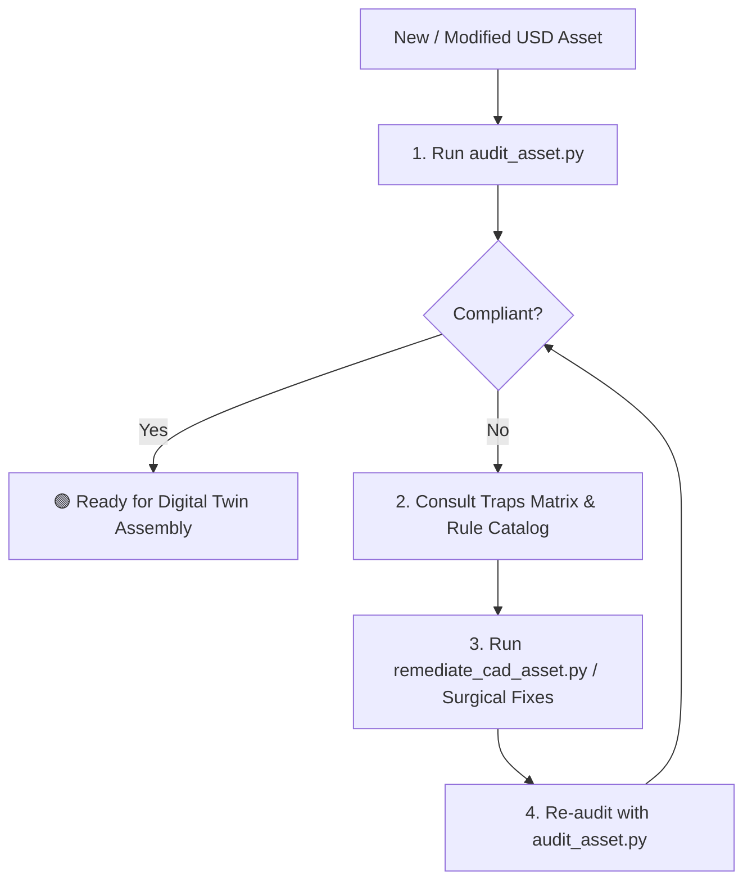

# SimReady CAD Conditioning & Conformance Pipeline

## 1. Overview & Operational Contract

Use this skill when:
1. The user asks to audit, evaluate, or determine the **SimReady (Simulation-Ready)** compliance of 3D assets (`.usd`, `.usda`, `.usdc`).
2. Raw CAD models (STEP, SolidWorks, JT, IGES, STL) have been exported or modified and need to be ingested into the digital twin.
3. Assets fail validation against `Prop-Robotics-Neutral` (v1.0.0), `Robot-Body-Isaac` (v1.0.0), or `Robot-Body-Neutral` (v1.0.0).

This skill provides an autonomous, reproducible workflow to inspect OpenUSD stages, triage atomic rule failures, apply physics and material schemas, and verify 100% compliance.

---

## 2. Environment & Tooling Prerequisites

All SimReady commands must be executed using the SimReady Foundation Python environment:

```powershell
# Python Interpreter (relative path from repository root):
& "..\..\SimReady\simready-foundation\.venv\Scripts\python.exe" <script.py>
# Or via activated environment / system Python:
python <script.py>
```

### Key Paths in this Repository
* **Audit Tool:** `docs/simready/gemini_skills/simready-cad-pipeline/scripts/audit_asset.py`
* **Remediation CLI:** `docs/simready/gemini_skills/simready-cad-pipeline/scripts/remediate_cad_asset.py`
* **Rule Definitions:** `docs/simready/gemini_skills/simready-cad-pipeline/references/profiles_and_rules.md`
* **Trap Triage Matrix:** `docs/simready/gemini_skills/simready-cad-pipeline/references/common_traps_and_fixes.md`
* **Standalone Guide:** `docs/simready/standalone/README.md`
* **Remediation Cheatsheet:** `docs/simready/standalone/cad_remediation_cheatsheet.md`

---

## 3. Autonomous Execution Protocol

Follow this 4-step loop when assessing or repairing any asset:



### Step 1: Execute Asset Audit
Run the CLI audit tool against the target USD asset:

```powershell
& "..\..\SimReady\simready-foundation\.venv\Scripts\python.exe" `
  "docs/simready/gemini_skills/simready-cad-pipeline/scripts/audit_asset.py" `
  "path/to/asset.usd" `
  --profile "Prop-Robotics-Neutral" `
  --quiet
```

### Step 2: Consult References & Triage Failures
If the audit exits with code `1`, inspect the failing requirement codes and consult:
- [`references/profiles_and_rules.md`](./references/profiles_and_rules.md) for requirement contracts.
- [`references/common_traps_and_fixes.md`](./references/common_traps_and_fixes.md) for triage workarounds.

#### Crucial Triage Guidelines:
1. **Multi-Body on Props (`FET004_BASE_NEUTRAL` / `RB.MB.001`):**
   `FET004` is documented as `optional = true` for `Prop-Robotics-Neutral` in `profiles.toml`. If a single-body prop (table, bin, wall, stand) passes `FET000`, `FET001`, `FET003`, `FET005`, and `FET006`, it is **100% compliant**. Do not author dummy joints or artificial second rigid bodies.
2. **Ghost S3 URLs (`AA.001`):**
   Even after updating `inputs:diffuse_texture`, Omniverse attributes often retain old URLs in `customData['default']`. Always purge `customData['default']`.
3. **Collision Placement (`RB.COL.001`):**
   Colliders must be on leaf `UsdGeom.Mesh` prims. Never leave `CollisionAPI` on `UsdGeom.Xform`.
4. **Robot Joint Drives (`FET022`):**
   `pxr.PhysxSchema.JointStateAPI` requires the Omniverse Kit / Isaac Sim runtime. Standalone OpenUSD verification validates `FET001`, `FET003`, `FET004`, and `FET024`.

### Step 3: Execute Automated CAD Remediation
For unconditioned CAD assets or props requiring standard conditioning, execute the remediation pipeline:

```powershell
# For assets already in meters:
& "..\..\SimReady\simready-foundation\.venv\Scripts\python.exe" `
  "docs/simready/gemini_skills/simready-cad-pipeline/scripts/remediate_cad_asset.py" `
  "path/to/raw_asset.usd"

# For raw CAD assets exported in millimeters:
& "..\..\SimReady\simready-foundation\.venv\Scripts\python.exe" `
  "docs/simready/gemini_skills/simready-cad-pipeline/scripts/remediate_cad_asset.py" `
  "path/to/raw_asset.usd" `
  --scale-points `
  --scale-factor 0.001
```

The script automatically executes:
1. Units (`metersPerUnit = 1.0`, `upAxis = "Z"`).
2. Hierarchy (`kind = "component"`, `defaultPrim`, `SimReady_Metadata`).
3. Asset atomicity (purging ghost S3 URLs in `customData['default']`).
4. Texture colorspace normalization (`colorSpace = "raw"`).
5. Rigid body dynamics & default mass (`10.0` kg).
6. Leaf collider relocation and convex hull assignment.
7. Physics material authoring and binding (`static_friction=0.6`, `dynamic_friction=0.5`, `restitution=0.1`).
8. Grasp affordance vector authoring (`UsdGeom.BasisCurves`).

### Step 4: Re-Audit & Verify Digital Twin Assembly
1. Re-run `audit_asset.py` on the modified asset to verify `100% SIMREADY COMPLIANT`.
2. If the asset is integrated into `workcell_digitaltwin.usd`, run the full stage composition check:
   ```powershell
   & "..\..\SimReady\simready-foundation\.venv\Scripts\python.exe" `
     "docs/workcell-digitaltwin/helper_scripts/full_system_verification.py"
   ```
