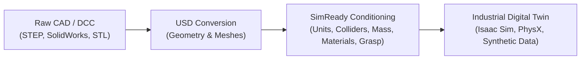
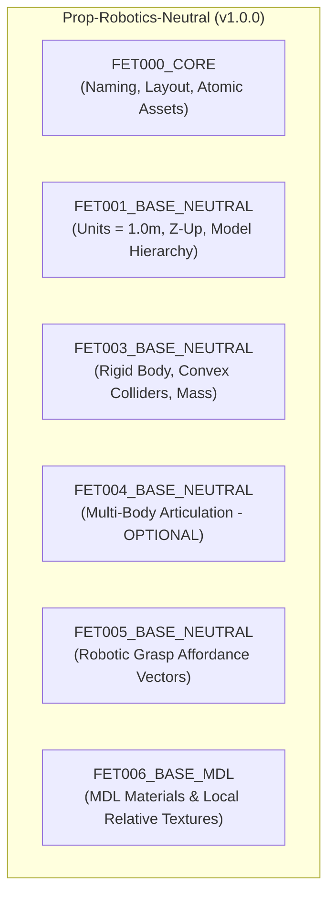
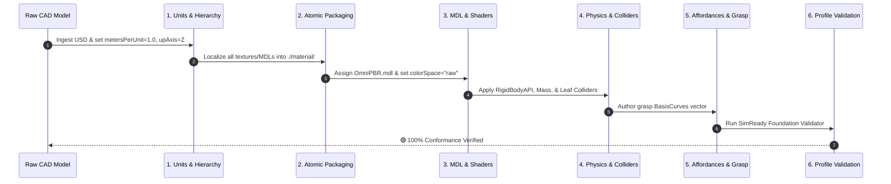

# SimReady OpenUSD Asset Architecture & Engineering Manual

This document is the standalone engineering reference for creating, auditing, and maintaining **NVIDIA SimReady (Simulation-Ready) OpenUSD** assets across their lifecycle—from raw CAD export to physics-enabled digital twins.

---

## 1. What is SimReady OpenUSD?

A visual 3D asset (e.g., standard GLTF, OBJ, or basic USD export from CAD) defines only shapes, colors, and visual textures. In contrast, a **SimReady OpenUSD** asset is a physically grounded, syntactically verified digital twin designed to behave identically in simulation environments (NVIDIA Omniverse, Isaac Sim, PhysX) as its counterpart behaves in the physical world.



### The SimReady Mental Model

The NVIDIA SimReady foundation standardizes 3D asset metadata and physics through four hierarchical layers:

1. **Requirements:** Atomic, testable rules with stable alphanumeric codes (e.g., `UN.007`, `PMT.001`, `RB.COL.001`, `AA.001`).
2. **Capabilities:** Functional domains grouping related requirements:
   - **Core (`NP`, `SR`):** Naming conventions, pathing, packaging, and metadata.
   - **Units & Hierarchy (`UN`, `HI`, `PMT`):** Meter scaling, up-axis, kind assignment, and model hierarchy.
   - **Physics & Collisions (`RB`, `DJ`, `PMT`):** Rigid bodies, collision meshes, mass, joints, and articulation.
   - **Visual Materials (`VM`, `AA`):** MDL shaders, texture formats, color spaces, and atomic pathing.
   - **Affordances (`GSP`):** Robot grasp affordances and interaction vectors.
3. **Features:** Versioned contracts representing specific operational capabilities (e.g., `FET000_CORE`, `FET001_BASE_NEUTRAL`, `FET003_BASE_NEUTRAL`, `FET005_BASE_NEUTRAL`, `FET006_BASE_MDL`, `FET024_BASE_ARTICULATION`).
4. **Profiles:** Versioned bundles of features specifying the complete requirement checklist for an asset class (e.g., `Prop-Robotics-Neutral`, `Robot-Body-Neutral`).

---

## 2. Global Standards & Constraints

All SimReady assets authored or validated in this repository must strictly adhere to the following global conventions:

| Parameter | Standard Value | Rationale / Requirement |
| :--- | :--- | :--- |
| **Length Units (`metersPerUnit`)** | `1.0` (Meters) | Isaac Sim and PhysX run on standard SI MKS units (`UN.007`). Never leave assets in millimeters (`0.001`) or centimeters (`0.01`). |
| **Up Axis (`upAxis`)** | `"Z"` | Standard robotics and architectural world orientation (`UN.006`). |
| **Asset Portability** | **100% Atomic & Local** | Zero external network dependencies (no AWS S3 or Omniverse Nucleus URLs). All shaders and textures must reside in local subfolders (`materials/`, `textures/`) and use relative paths (`./`) (`AA.001`). |
| **Texture Color Space** | `"raw"` or `"sRGB"` | Shader texture attributes (`inputs:diffuse_texture`) must explicitly set `colorSpace = "raw"` unless listed in the official sRGB exception table (`VM.TEX.002`). |
| **Collision Target Prims** | Leaf `UsdGeom.Mesh` only | Collision APIs (`UsdPhysics.CollisionAPI`, `UsdPhysics.MeshCollisionAPI`) must never be applied to parent `UsdGeom.Xform` prims (`RB.COL.001`, `RB.COL.002`). |

---

## 3. Profiles & Conformance Contracts

### 3.1 `Prop-Robotics-Neutral` (v1.0.0)

Used for all rigid props, static fixtures, conveyors, inspection tables, safety fences, workbenches, and industrial parts.



#### Feature Breakdown
* **`FET000_CORE`:** Verifies asset layout, relative paths, metadata sidecars (`SR.001`), and atomic portability (`AA.001`).
* **`FET001_BASE_NEUTRAL`:** Enforces `metersPerUnit = 1.0`, `upAxis = "Z"`, top-level `kind = "component"`, and manifold mesh topology.
* **`FET003_BASE_NEUTRAL`:** Validates rigid body dynamics (`UsdPhysics.RigidBodyAPI`), collider definition (`UsdPhysics.CollisionAPI`), mass/density (`UsdPhysics.MassAPI`), and bound physics materials (`PMT.001`).
* **`FET004_BASE_NEUTRAL` (Multi-Body):** **Optional** in `profiles.toml` for props. For single-rigid-body props (tables, bins, walls, stands), multi-body joint rules are skipped and considered fully compliant. For multi-link articulated props (e.g., modular conveyors, jigs with latches), revolute/prismatic joints and links are validated.
* **`FET005_BASE_NEUTRAL`:** Verifies the presence of robotic grasp guidance curves (`UsdGeom.BasisCurves`) under `/AssetRoot/grasp_identifier_01` (`GSP.001`).
* **`FET006_BASE_MDL`:** Ensures all shaders use standard NVIDIA MDL schemas (`OmniPBR.mdl` or `OmniSurface.mdl`), resolve locally, and have valid texture mappings.

### 3.2 `Robot-Body-Neutral` (v1.0.0)

Used for industrial manipulators and robot arms (e.g., Universal Robots UR10).

* **`FET001_BASE_NEUTRAL`:** Base geometry and units verification.
* **`FET003_BASE_NEUTRAL`:** Dynamic links and inertia tensors for all kinematic segments.
* **`FET004_BASE_NEUTRAL`:** Complete multi-body kinematic tree, joint limits, axes, and link chains.
* **`FET024_BASE_ARTICULATION`:** Exactly **1** unified `UsdPhysics.ArticulationRootAPI` authored at the robot's base or root joint.
* **Runtime Note (`FET022`):** Joint drive state schemas (`pxr.PhysxSchema.JointStateAPI`) operate inside the Omniverse Kit / Isaac Sim runtime where NVIDIA's closed-source PhysX extension is loaded.

---

## 4. Standard USD Prim Hierarchy & Schema Layout

A conforming SimReady prop asset must follow this canonical OpenUSD hierarchy:

```text
/<AssetRoot> [Xform: kind="component", SimReady_Metadata]
 ├── /geometry [Scope or Xform]
 │    ├── /visual [Scope or Xform]
 │    │    └── /mesh_01 [Mesh: MaterialBindingAPI]
 │    └── /collisions [Scope: visibility="invisible"]
 │         └── /collision_mesh_01 [Mesh: CollisionAPI, MeshCollisionAPI, MaterialBindingAPI(physics)]
 ├── /material [Scope]
 │    ├── /OmniPBR [Shader: info:mdl:sourceAsset="./material/OmniPBR.mdl"]
 │    ├── /PhysicsMaterial [Material: UsdPhysics.MaterialAPI]
 │    └── /VisualMaterial [Material: UsdShade.Material]
 └── /grasp_identifier_01 [BasisCurves: GSP.001 linear vector]
```

### Key Rules
1. **Separation of Visuals and Collisions:**
   Visual meshes high in polygon count should not be used as physics colliders. Create dedicated, simplified convex hull meshes under `/geometry/collisions`, set their visibility to `invisible`, and attach `UsdPhysics.CollisionAPI` and `UsdPhysics.MeshCollisionAPI(approximation="convexHull")`.
2. **Leaf Mesh Colliders Only:**
   Never attach `UsdPhysics.CollisionAPI` to an `Xform` prim. OpenUSD physics engines require colliders on leaf geometry prims (`UsdGeom.Mesh`, `UsdGeom.Cube`, etc.).
3. **Physics Material Binding:**
   Every collider must have a bound physics material via `UsdShade.MaterialBindingAPI(prim).Bind(phys_mat, "physics")` specifying static friction, dynamic friction, and restitution.

---

## 5. The 8-Step CAD-to-SimReady Remediation Pipeline

When raw CAD models (STEP, IGES, SolidWorks, JT) are converted to USD, they lack physical schemas, scale conventions, and metadata. Execute this standard 8-step pipeline to promote raw CAD into a verified SimReady asset:



### Step 1: Normalize Stage Units and Axis (`UN.007`, `UN.006`)
* Set stage `metersPerUnit = 1.0` and `upAxis = "Z"`.
* If raw CAD was exported in millimeters, scale the mesh vertex positions (`points` attribute) by $0.001$ rather than applying an `xformOp:scale` on the root, ensuring collision geometries are naturally sized.

### Step 2: Structure Model Hierarchy & Metadata (`HI.010`, `SR.001`)
* Set root prim `kind = "component"`.
* Author `customLayerData["SimReady_Metadata"]` on the root layer:
  ```python
  stage.GetRootLayer().customLayerData = {
      "SimReady_Metadata": {
          "asset_name": "conveyor",
          "asset_type": "prop",
          "simready_version": "1.0.0"
      }
  }
  ```

### Step 3: Localize Dependencies & Purge Remote URLs (`AA.001`, `NP.008`)
* Download any external textures or MDLs into `./material/` or `./textures/`.
* Rewrite all SdfAssetPath attributes to use `./material/...`.
* **Trap:** Delete residual S3 URLs hidden in `attr.GetCustomDataByKey('default')`.

### Step 4: Shader Schema & Colorspaces (`VM.MDL.001`, `VM.TEX.002`)
* Standardize shaders to `OmniPBR.mdl`.
* For any texture input (e.g. `inputs:diffuse_texture`), ensure `colorSpace = "raw"`.

### Step 5: Author Rigid Body Dynamics & Mass (`RB.001`, `RB.007`)
* Apply `UsdPhysics.RigidBodyAPI.Apply(prim)` on the primary dynamic body.
* Apply `UsdPhysics.MassAPI.Apply(prim)` and specify either `physics:mass` in kg or `physics:density`.

### Step 6: Author Simplified Colliders (`RB.COL.001`, `RB.COL.002`)
* Target leaf `UsdGeom.Mesh` prims.
* Apply `UsdPhysics.CollisionAPI.Apply(mesh_prim)`.
* Apply `UsdPhysics.MeshCollisionAPI.Apply(mesh_prim)`.
* Set `approximation = "convexHull"` (or `"convexDecomposition"` for concave parts).

### Step 7: Bind Physics Materials (`PMT.001`)
* Create `/World/Looks/PhysicsMaterial` (or under `/<AssetRoot>/material/PhysicsMaterial`).
* Apply `UsdPhysics.MaterialAPI.Apply(material_prim)`.
* Set static friction ($0.6$), dynamic friction ($0.5$), and restitution ($0.1$).
* Bind using `material_binding_api.Bind(material_prim, "physics")`.

### Step 8: Author Robotic Grasp Affordance (`GSP.001`)
* Create a linear guide curve `UsdGeom.BasisCurves.Define(stage, "/<AssetRoot>/grasp_identifier_01")`.
* Set `type = "linear"`, `curveVertexCounts = [2]`, and 2 control points defining the gripper approach/grasp vector.

---

## 6. Running Validation

To validate any asset in the repository against its target SimReady profile, execute the SimReady Foundation validator using the project's dedicated Python virtual environment:

```powershell
& "..\..\SimReady\simready-foundation\.venv\Scripts\python.exe" `
  "docs/simready/gemini_skills/simready-cad-pipeline/scripts/audit_asset.py" `
  --asset "components/conveyor/conveyor.usd" `
  --profile "Prop-Robotics-Neutral"
```

A passing audit will confirm 100% compliance across `FET000_CORE`, `FET001_BASE_NEUTRAL`, `FET003_BASE_NEUTRAL`, `FET005_BASE_NEUTRAL`, and `FET006_BASE_MDL`.
